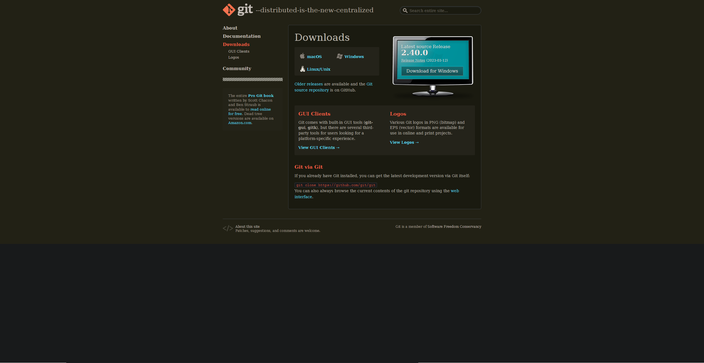
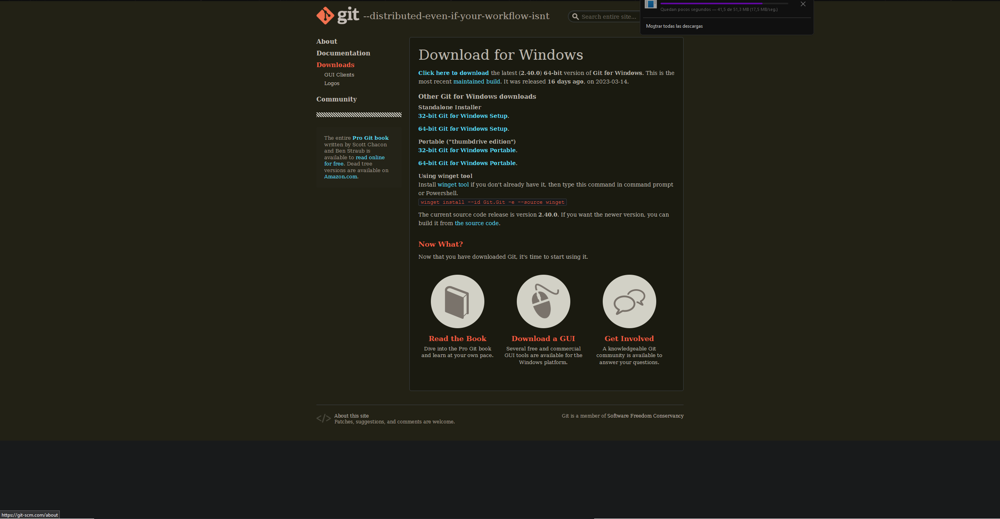
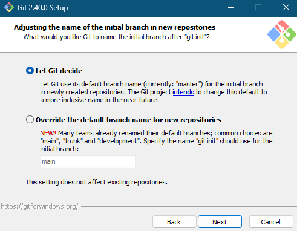
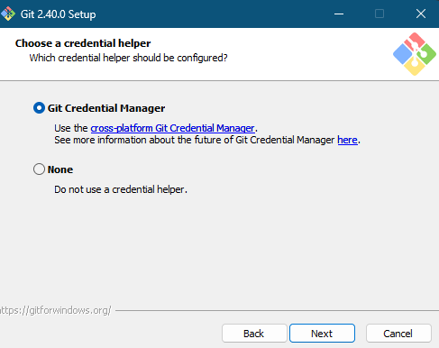

# Proyecto de ejemplo usando git (con GitHub)

## Primeramente nos instalaremos git.

Para ello, realizaremos los siguiente paSos:
    
1. ## Nos dirigiremos a la pagina de descarga de Git y pusalrEmos en descargar.
   
   

2. ## Pulsaremos sobre la descarga que nos corresponda.
   En caso de estar en un sistema operativo basado en UniX / Linux, recomendamos usar el gestor de paquetes correspondiente a esa distribucion
   
   

3. ## Como en cualquier otra instalacion pulsaremos en siguiente (obviamente cambiandO los parametros de instalacion a nuestro gusto).
   Y nos detendremos hasta el punto en el que encontremos hasta que encontremos una opcion como la siguiente
   
   

> Esta opcion nos permira cambiar la rama por defecto al crear nuestros repositorios locales, en nuestro caso recomendamos usar el nombre main, ya que si dejamos la que viene por defeceto, es decir 'master', creara conflictos con el repositorio remoto que usemos en GitHub, ya que este ultimo por defecto crea las ramas con el nombre main

4. ## Seguiremos pulsando en siguiente, hasta que llegemos a este punto:
   

> Esta opcion nos permite elegir el metodo de inicio de sesion para el repositorio remoto, en nuestro caso, elegiremos no elegir ningun metodo, esto para englobar mas el uso de git para cualquier sistema operativo. Ya que en sistemas Linux no viene preinstalado el Git Crendential Manager

# Comenzaremos con el tutorial de uso basico, en el que veremos como crear un repositorio tanto local como remoto hasta como aceptar pull requests

1. ## Primeramente, crearemos el repositorio local, de la siguiente manera:
    1. Iremos a la carpeta donde queremos crear nuestro repositorio
    2. Usaremos la terminal para crear nuestro repositorio, escribiendo el siguiente comando:

    

    > De esta forma el repositorio estara creado localmente.

2. ## Ahora crearemos el repositorio remoto, ya que vamos a utilizar GitHub para hostearlo, necesitaremos una cuenta, que se crearia como en cualquier otra plataforma.

    1. ### Para ello accederemos a nuestra cuenta de GitHub y haremos click sobre 'Your Repositories':

        

    2. ### Clicaremos sobre `New`

        

    3. ### Y rellenaremos los campos que nos piden de informacion

        

    4. ### Una vez hayamos pulsado sobre 'Create repository', tendremos por fin nuestro repositorio remoto creado:

        

3. ## A continuacion, agregaremos los archivos que queramos subir a nuestro repositorio local.
    - Para ello utilizaremos el siguiente comando:

    

    > De esta forma Git tendra en cuenta los archivos del repositorio,
    > para manejarlos mas tarde, ya sea para publicarlos en un repositorio remoto o hacer un cambio en varios ficheros as la vez.
    > Esto hara que git guarde los ficheros en lo que se suele conocer como un stage

4. ## Para poder subir los ficheros y carpetas al repositorio remoto, tendremos que hacer una serie de pasos previos antes de subirlos.

    1. Obtener la URL del repositorio remoto y agregarle un token de usuario, para ello accederemos a la siguiente direccion de [GitHub Tokens](https://github.com/settings/tokens)

    2. Y crearemos un nuevo token con los siguiente persmisos, que son los necesarios para manejar repositorios

        

    > Usaremos el token clasico, por que las nuevas versines de token pueden llegar a ser inestables o no funcionar en determinado momento, debido a que estan en fase beta
    
    - Antes de poder crear un token, nos pedira introducir la contraseña de nuestra contraseña.

    - Acto seguido, le asignaremos un nombre a nuestro nuevo token y seleccionaremos solo los permisos llamados 'repo'

        

    - Bajaremos hasta encontrar un boton verde que dice: "Generate Token"

    5. Despues de pulsar en 'Generate token' nos saldra un codigo hash, el cual nos servira como un metodo de autentificacion para que Git pueda acceder a nuestro repositorio remoto
        

    6. El token que nos devolvio la pagina anterior, deberemos de copiarlo y guardarlo.

        Cuidado, ya que debe de ser guardado con sumo cuidado, ya que si alguien indiseado tuviera acceso a este token, podria modificar nuestros repositorios.

    7. Con el token ya copiado nos dirigiremos a nuestra terminal:

        

        Aqui deberemos de escribir algo similar a este comando, añadiendo antes del hash del comando 'htps://'

    8. Sin haber presionado enter, nos dirigiremos a la pagina de nuestro repositorio y copiaremos lo siguiente:

        Pulsaremos sobre el boton verde que dice 'Code' y copiaremos desde despues de la doble barra: github.com...

        

    9. Volveremos a nuestra terminal donde habia copiado nuestro nuevo token generado:

        

        Esto comando le dice a git como se llama nuestro repositorio, en este caso se le asigna automaticamente 'origin' y donde encontrarlo, que es este enlace que hemos formado, de tal forma que esta URL que hemos formado se compondria de nuestro token mas nuestro repositorio remoto.
        
        Una vez hecho esto pulsaremos enter.

    10. Añadiendo un commit a nuestros cambios.

        Un commit es un mensaje que nosotros mismos escribiremos, con la finalidad de indicar que cambios hemos hecho, asi a la hora de revisar neustro codigo subido, sabremos donde encontrar algo en especifico

        

        - El comando se compone de:
            - El parametro 'commit', esto le indica a git que vamos a escribir un nuevo commit.
            - Adicionalmente, añadiremos el parametro '-m', esto le indica a git que seguido de este parametro ira un mensaje en formato de string, es decir, todo el mensaje debera de estar entrecomillado
        
        - En este caso, recomendamos usar una estructura similar a la siguiente para los mensajes:
            - Entre corchetes indicamos que tipo de cambio hemos realizado
            - Seguido de que cambios hemos hecho, se suele recomendar mensajes no muy largos, y que implementen algunos simbolos extraños.

    11. Una vez hecho todos estos pasos, solo nos falta un paso mas para poder subir nuestros cambios al repositorio remoto:

        Ya que hemos creado de forma indpendendiente los repositorios tanto local como remoto, ninguno de ellos conoce que cambios poseen en su stage o rama.

        Para soluciones esto haremos uso del comando git pull, tal que asi:

        

        Con esto le estaremos diciendo a Git que traiga los archivos desconocidos del repositorio remoto al local, de esta forma, ambos estaran combinados.
        
        > El parametro adicional al final, '--allow-unrelated-histories', le dice a git que permita este tipo de 'pulls', ya que de por sì, si git no conoce absolutamente nada del repositorio remoto mas que su ubicacion a traves de la URL previamente proporcionada, este tratara a la rama remota como una rama desconocida. Esta parametro nos ayuda a saltar esta limitacion, para que git fusione las 2 ramas en una sola, pese a que se llamen igual.

        Cuando demos enter para ejecutar el comando, git nos devolvera un log de aviso de que cambios se han realizado
        

    12. Finalmente, podremos subir los nuevos ficheros al repositorio remoto de la siguiente manera:

        

        De esta forma, le estaremos diciendo a Git que subiremos los archivos que esten en el stage actual, los cuales fueron añadido previamente con el comando 'git add .'

    13. Si ahora nos dirigimos a nuestro repositorio de GitHub, veremos que ha cambiado el contenido de nuestro repositorio, de acuerdo a nuestros ficheros locales

        